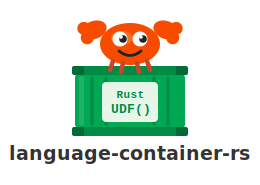

<div align="center">




A pure-Rust Exasol Language Container that executes precompiled `.so` UDFs from BucketFS via the native ZMQ+Protobuf SLC protocol.

</div>

## What it is

[Exasol](https://www.exasol.com) is a high-performance analytic database built for speed and scalability. You can try it immediately with the [SaaS free trial](https://cloud.exasol.com) or spin up a local instance using the [Docker image](https://hub.docker.com/r/exasol/docker-db).

`language-container-rs` is the Rust Language Container for Exasol. It lets data engineers write UDFs in Rust — compiled to `.so` shared libraries, uploaded to BucketFS once, and loaded at query time. Third-party crates are statically linked into the `.so`, so adding a dependency never requires redeploying the language container.

Two further capabilities ship out of the box:

- **Connect-back** — a UDF can open an ADBC session back to Exasol mid-execution and stream Apache Arrow record batches to or from the database.
- **Cluster distribution** — Exasol executes SET UDFs on every node in parallel. Grouping by [`IPROC()`](https://docs.exasol.com/db/latest/sql_references/functions/alphabeticallistfunctions/iproc.htm) pins each group to the node that owns the data, saturating the full cluster with a single query.

The workspace ships three crates for UDF authors, container operators, and build tooling — plus the protocol layer that wires them together.

## Prerequisites

- **Docker** — to build the language container image
- **[exapump](https://github.com/exasol-labs/exapump)** — to upload to BucketFS and run SQL
- **Rust 1.92+** with `cargo` — to compile UDFs
- An Exasol instance: [SaaS free trial](https://cloud.exasol.com), [Docker image](https://hub.docker.com/r/exasol/docker-db), or enterprise

## Install the language container

`scripts/install.sh` builds the Docker image, exports the container filesystem, uploads it to BucketFS, and registers the `RUST` script language — all in one command:

```bash
scripts/install.sh \
  --host localhost \
  --password exasol \
  --bfs-password <write-password>
```

The BucketFS write password for the Docker image can be read with:

```bash
docker exec exasol-db bash -c \
  "xmllint --xpath '//BucketFSService[@id=\"bfsdefault\"]/Bucket[@id=\"default\"]/WritePasswd/text()' \
  /exa/etc/EXAConf"
```

Full option reference: `scripts/install.sh --help`

## Quick start

```rust
use exasol_udf_macros::exasol_udf;
use exasol_udf_sdk::{
    context::UdfContext,
    error::UdfError,
    value::Value,
};

#[exasol_udf]
pub fn double(ctx: &mut dyn UdfContext) -> Result<(), UdfError> {
    // get_i64 transparently accepts BIGINT, which Exasol delivers as
    // Value::Numeric on the wire — no manual variant matching needed.
    let out = match ctx.get_i64(0)? {
        Some(n) => Value::Int64(n * 2),
        None    => Value::Null,
    };
    ctx.emit(&[out])
}
```

**Build**

```bash
cargo exaudf build
# → target/x86_64-unknown-linux-musl/release/libdouble.so
```

**Deploy**

```bash
exapump bfs upload \
    target/x86_64-unknown-linux-musl/release/libdouble.so \
    /buckets/bfsdefault/default/udf/libdouble.so
```

**Create script**

```sql
CREATE OR REPLACE RUST SCALAR SCRIPT my_schema.double(val BIGINT)
RETURNS BIGINT AS
%udf_object /buckets/bfsdefault/default/udf/libdouble.so;
/
```

## Crates

| Crate | Audience | Purpose |
|-------|----------|---------|
| `exasol-udf-sdk` | UDF authors | Trait, macros, types |
| `exa-udf-runtime` | Container operators | ZMQ host-dispatch runtime |
| `cargo-exaudf` | Build tooling | Build/validate `.so` UDF artifacts |

## Documentation

| | |
|---|---|
| [Writing a Rust UDF](docs/writing-a-udf.md) | Implement, test, build and deploy a UDF from scratch |
| [Exasol UDF protocol](docs/protocol.md) | The ZMQ REQ/REP + Protobuf SLC wire protocol |
| [Cargo ecosystem](docs/cargo-ecosystem.md) | Workspace layout, feature flags, build tooling |

Full index → [docs/index.md](docs/index.md)

## License

Community-supported. Licensed under [MIT](LICENSE).

---
<div align="center">Built with Rust 🦀 and made with ❤️ as part of <a href="https://github.com/exasol-labs">Exasol Labs</a> 🧪.</div>
